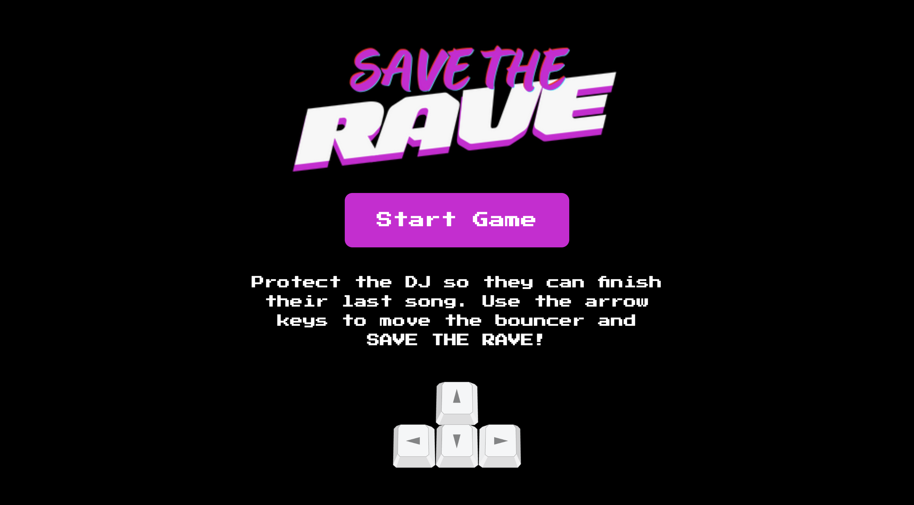
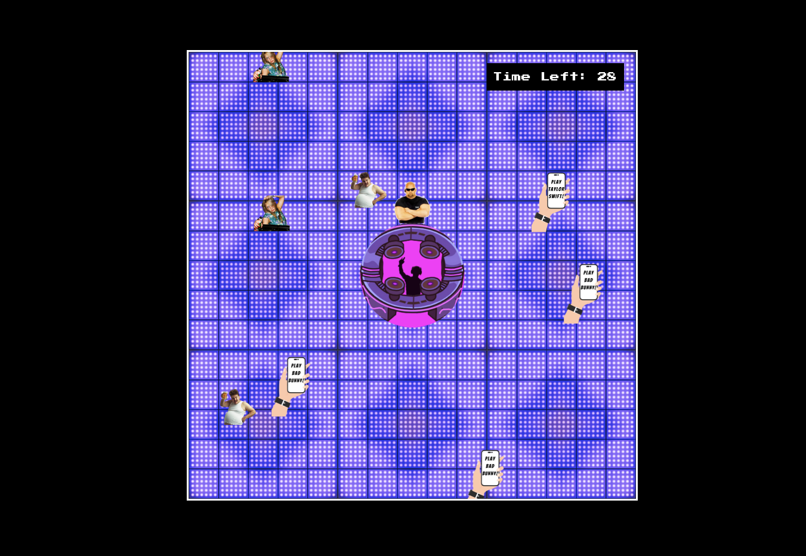

# Save The Rave

Save The Rave is a fun and exciting canvas game that challenges players to save a rave party by stopping distractions from getting to the DJ. The game features a lively soundtrack and a colorful theme.

## Table of Contents

1. [How to Play](#how-to-play)
2. [Technologies](#technologies)
3. [Project Structure](#project-structure)
4. [License](#license)
5. [Support](#support)

## How to Play

1. Visit https://brodiekime21.github.io/project-1-the-game/ in your browser.

2. Press the **Start Game** button.

3. Use the arrow keys (left, right, up, and down) to control the bouncer/security.

4. Stop the distractions or annoyances from reaching the DJ in the center of the screen.

5. Enjoy the game's 3 different songs that are randomly rotated and played for 45 seconds each until the song's drop. Successfully protect the DJ for the entire duration to win!

6. If a distraction reaches the DJ, a DJ spinback sound will play, and a message specific to the type of distraction will be displayed.

## Technologies

- HTML
- CSS
- JavaScript
- Canvas API

## Project Structure

The project consists of the following files:

1. `index.html`: The main HTML file that contains the structure of the game, including the game board, intro section, and game controls.

2. `style.css`: This file contains the styling for the game, including colors, fonts, and layout.

3. `main.js`: This is the main JavaScript file that handles the game logic, such as player movement, collision detection, and managing the soundtrack.

4. `assets`: A folder containing all the images and audio files used in the game, such as the bouncer, distractions, and music tracks.

## License

This project is licensed under the Creative Commons Attribution-NonCommercial-ShareAlike 4.0 International License - see the [LICENSE](LICENSE) file for details.

## Support

If you have any questions or encounter any issues while playing the game, please open an issue on the GitHub repository.